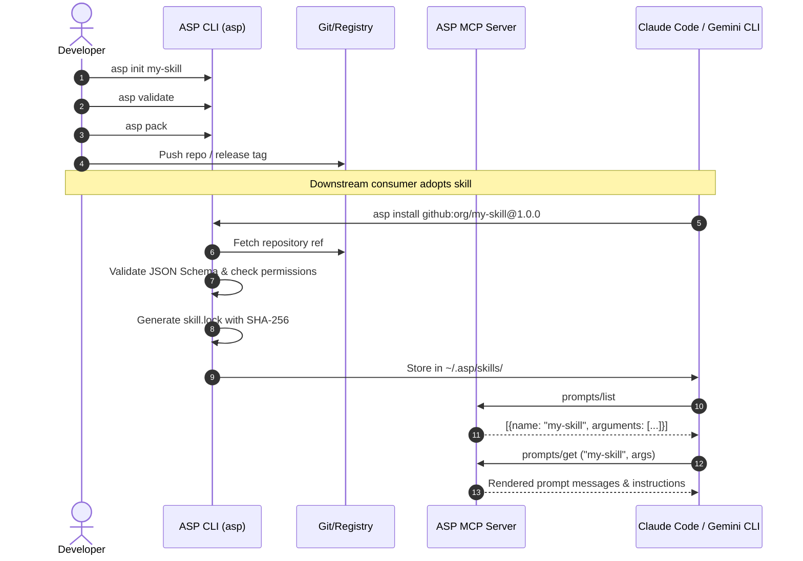

# ASP Architecture

This document describes the layered system architecture of the AI Skill Protocol (ASP).

---

## 1. Architectural Philosophy

ASP is designed around four foundational principles:

1. **Protocol, not a framework**: ASP does not orchestrate agent execution loops or manage agent memory. It specifies the packaging, contract, validation, and delivery interfaces for portable intelligence units.
2. **Deterministic & Auditable**: Every skill package carries a machine-generated cryptographic manifest (`skill.lock`) with SHA-256 digests. What you test in CI is precisely what executes in production.
3. **Vendor Agnostic by Default**: Skills declare behavioral requirements (`capabilities: [text_generation, reasoning]`, `context_window: ">=32k"`) rather than tying themselves to proprietary model names or vendor APIs.
4. **Leverage Existing Standards**: Where open standards already solve part of the problem (JSON Schema Draft 2020-12, SemVer 2.0.0, gzip/tar, Model Context Protocol), ASP builds on top rather than reinventing.

---

## 2. Protocol Layers

```
+-----------------------------------------------------------------------+
| Layer 4: Runtime Consumers & Adapters                                 |
| Claude Code (.claude/skills) | Gemini CLI (GEMINI.md) | LangChain SDK |
+-----------------------------------▲-----------------------------------+
                                    │ stdio / JSON-RPC 2.0 (MCP Prompts)
+-----------------------------------┴-----------------------------------+
| Layer 3: Distribution & Interface CLI (asp)                           |
| init | validate | pack | install | list | search | generate | mcp      |
+-----------------------------------▲-----------------------------------+
                                    │
+-----------------------------------┴-----------------------------------+
| Layer 2: Registry & Transport                                         |
| Git-native (GitHub/GitLab) | Filesystem (dev) | HTTP Registry (v1 API)|
+-----------------------------------▲-----------------------------------+
                                    │
+-----------------------------------┴-----------------------------------+
| Layer 1: Package Format (.skill)                                      |
| Gzip Tarball: skill.yaml + skill.lock + README.md + examples/         |
+-----------------------------------▲-----------------------------------+
                                    │
+-----------------------------------┴-----------------------------------+
| Layer 0: Normative Specification                                      |
| SPEC.md + schema/skill-manifest.schema.json (JSON Schema Draft 2020)  |
+-----------------------------------------------------------------------+
```

### Layer 0 — Normative Specification
The source of truth. Any tool or language (Python, TypeScript, Go, Rust) can validate whether an artifact is a conforming ASP manifest purely by evaluating it against `schema/skill-manifest.schema.json`.

### Layer 1 — Package Format (`.skill`)
A `.skill` archive is an immutable distribution artifact:
- `skill.yaml`: Declarative manifest containing instructions, typed schema, permissions, and runtime metadata.
- `skill.lock`: Generated lockfile recording exact SHA-256 checksums of manifest and pinned dependency versions.

### Layer 2 — Registry Abstraction
Decouples skill consumption from skill hosting:
- **Git Registry**: Git-native resolution (`github:org/repo@v1.2.0`) without requiring centralized infrastructure.
- **Filesystem Registry**: Local monorepo or internal development without network dependencies.
- **HTTP Registry**: Standards-based REST API for enterprise firewalls and private registries.

### Layer 3 — Reference CLI & Engine
The `asp` tool provides developer ergonomics for authoring, packaging, verifying, resolving dependencies, and serving skills.

### Layer 4 — Runtime Adapters
Enables interoperability across heterogeneous host environments:
- **MCP Server (`asp mcp serve`)**: Connects ASP directly to Claude Code, Gemini CLI, Cursor, or any MCP client via the `prompts/list` and `prompts/get` JSON-RPC primitives.
- **Static Generators (`asp generate claude`, `asp generate gemini`)**: Materializes declarative instructions into host-native instruction markdown files for environments without active daemon processes.

---

## 3. End-to-End Interoperability Workflow



---

## 4. Why Independent Implementations Can Interoperate

Because Layer 0 is purely declarative and uses JSON Schema:
1. A skill authored on Linux with the Python CLI can be packed and distributed to a Windows system running a TypeScript-based ASP client.
2. A tool built in Go can validate and execute the same `skill.yaml` without importing any Python dependencies.
3. The lockfile format specifies deterministic SHA-256 hashes, ensuring bit-for-bit verification regardless of operating system or host environment.
